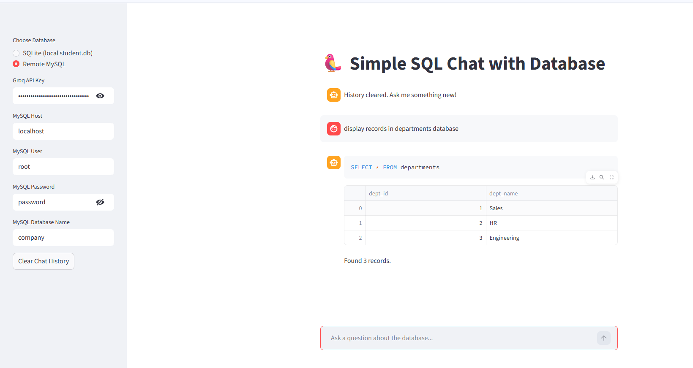

# 🤖 Conversational NL2SQL Engine: Llama-3 & Streamlit

An intelligent data interaction layer that transforms natural language into executable SQL queries. This project bridges the gap between non-technical users and complex relational databases using **Llama-3.1** and **LangChain**.

🚀 **[View Live Demo](https://search-engine-using-tools-agents-n3matyv6frxjtmxdjctzwh.streamlit.app/)**

---

## 🖼️ Preview


---

## 🌟 Key Features

* **Natural Language to SQL (NL2SQL)**: Convert plain English questions like *"Who are the students in Data Science with marks above 80?"* into precise SQL commands.
* **Dual-Database Support**: Seamlessly switch between local **SQLite** (pre-loaded with student data) and remote **MySQL** instances.
* **Dynamic Schema Inspection**: The agent automatically reads your table structures and column names to ensure query accuracy.
* **Interactive Data Visualization**: Results are returned as clean, searchable **Pandas DataFrames** directly in the chat interface.
* **Llama-3.1 Integration**: Powered by Groq's high-speed inference for near-instant query generation.

---

## 🛠️ Tech Stack

* **LLM Engine**: Llama-3.1-8b-instant (via Groq)
* **Orchestration**: LangChain
* **Database Tooling**: SQLAlchemy & SQLite3
* **Frontend**: Streamlit
* **Environment Management**: Python-Dotenv

---

## 🚀 Quick Start

1. **Clone the Repository**
   ```bash
   git clone https://github.com/djain28006/conversational-nl2sql-engine.git
   cd conversational-nl2sql-engine
   Install Requirements

pip install -r requirements.txt

Initialize the Database
Run the provided script to create the student.db file and insert sample records:

python sqlite.py

Launch the App

streamlit run app.py
🧠 The "Brain" (The Prompt)

The engine uses a specialized system prompt to ensure the LLM returns only raw SQL code:

"You are an expert SQL assistant. Use the following database schema information: {schema_info}. Convert this natural language question into a valid SQL query. Return ONLY the raw SQL query. No explanation, no backticks, no Markdown formatting."

👤 Author

Danish Jain
Aspiring Python Developer | Machine Learning Enthusiast

💼 LinkedIn: https://www.linkedin.com/in/danish-jain-6b9261316/

📂 GitHub: https://github.com/djain28006
